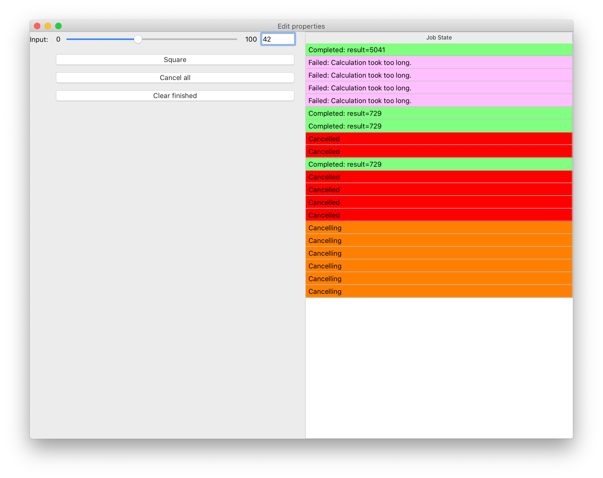
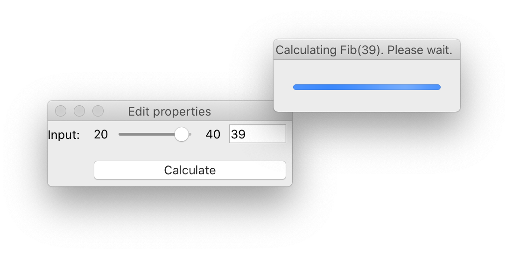

..
   (C) Copyright 2018-2021 Enthought, Inc., Austin, TX
   All rights reserved.

   This software is provided without warranty under the terms of the BSD
   license included in LICENSE.txt and may be redistributed only under
   the conditions described in the aforementioned license. The license
   is also available online at http://www.enthought.com/licenses/BSD.txt

   Thanks for using Enthought open source!

Complete examples
=================

This section describes a number of complete examples, that make use of the
various different background task types that Traits Futures currently supports.

Slow squares
------------

This :download:`example script <examples/slow_squares.py>` demonstrates a
simple TraitsUI application that allows several background calculations to be
running simultaneously, and displays the state of all previously submitted
calculations in a table. Each "calculation" is a squaring operation; the
calculation may fail randomly, with an increased chance of failure for larger
inputs.

.. literalinclude:: examples/slow_squares.py
   :start-after: Thanks for using Enthought
   :lines: 2-

Blocking call with dialog
-------------------------

This :download:`example script <examples/simple_blocking_call.py>` demonstrates
use of simple non-cancellable non-closable modal progress dialog to provide a
user with visual feedback, and keep a GUI responsive, while a blocking task
runs.

.. literalinclude:: examples/simple_blocking_call.py
   :start-after: Thanks for using Enthought
   :lines: 2-

Prime counting
--------------

.. image:: images/prime_counting.png
   :alt: Screenshot of the prime counting GUI in action

This :download:`example script <examples/prime_counting.py>` demonstrates the
:class:`~.ProgressFuture`, which reports progress information back to the
GUI as the background computation progresses.

.. literalinclude:: examples/prime_counting.py
   :start-after: Thanks for using Enthought
   :lines: 2-

Approximating Pi
----------------

.. image:: images/pi_iterations.png
   :alt: Screenshot of the π approximation GUI in action

The final :download:`example <examples/pi_iterations.py>` uses the Chaco 2d
plotting library and shows the use of the :class:`~.IterationFuture`.
Successive approximations to π are computed and plotted, with the plot
updated live with each new value reported by the background task.

.. literalinclude:: examples/pi_iterations.py
   :start-after: Thanks for using Enthought
   :lines: 2-
