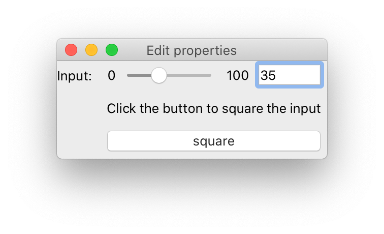

..
   (C) Copyright 2018-2023 Enthought, Inc., Austin, TX
   All rights reserved.

   This software is provided without warranty under the terms of the BSD
   license included in LICENSE.txt and may be redistributed only under
   the conditions described in the aforementioned license. The license
   is also available online at http://www.enthought.com/licenses/BSD.txt

   Thanks for using Enthought open source!

Overview
========

Why Traits Futures?
-------------------

In a nutshell, Traits Futures allows GUI applications to execute one or more
background tasks without blocking the main GUI, and then *safely* update the
GUI in response to full or partial results from those background tasks. For
more details and an explanation of why this is needed, read on.

The GUI frameworks that we work with in the Enthought Tool Suite are
essentially\ [#f1]_ single-threaded. When an application is started, the main
thread of the Python process enters the GUI framework's event loop, for example
via a call to |QApplication::exec|. That event loop then
waits for relevant events (user interactions with widgets, external network
events, timing events, and so on) in a loop, and when they occur, dispatches
those events to appropriate event handlers. In many cases those handlers take
the form of callbacks into Python code.

Traits-based GUIs that perform significant work in response to user
interactions (for example, running a complex computation, or submitting a
complex search query to a remote database) face two main problems.

Problem 1: unresponsive GUIs
~~~~~~~~~~~~~~~~~~~~~~~~~~~~

Thanks to the single-threaded nature of the GUI frameworks, the various
callbacks into Python land are executed in serial rather than in parallel: only
one callback can be executing at any given time, and that callback must
complete its execution before any other callback can start to execute. So while
a particular callback is executing, the GUI cannot respond to other user
interactions. This presents a problem if you want to run a calculation (for
example) from within a GUI.

The following :download:`example code <examples/calculate_in_main_thread.py>`
demonstrates this effect. It provides a simple GUI wrapper for a slow
calculation. In this case, the slowness is simulated via a call to
:func:`time.sleep`.

.. literalinclude:: examples/calculate_in_main_thread.py
   :start-after: Thanks for using Enthought
   :lines: 2-

When you run this code, you should see a dialog that looks something like
this (modulo platform-specific styling differences):

Before the "square" button is clicked, the input can be adjusted via
keyboard and mouse, and the window can be resized. But once the "square"
button is clicked, the GUI becomes unresponsive until the calculation
completes 10 seconds later: the input cannot be adjusted, and the window
cannot be resized.

There a second, subtler, problem with this code. In the ``_run_calculation``
method, before we kick off the long-running calculation we update the UI's
status message to report that a calculation is in progress. We then update the
message again at the end of that method with the result of the calculation. But
in the GUI, depending on the toolkit and operating system in use, we may never
see a message update for that first ``self.message =`` assignment. That's
because the graphical update occurs as the result of another task sitting in
the event loop's task queue, and our current callback is blocking that task
from executing.

Problem 2: Safely updating the GUI
~~~~~~~~~~~~~~~~~~~~~~~~~~~~~~~~~~

The solution to the responsiveness issue described in the previous section is
straightforward: we move the calculation to a separate thread or process,
freeing up the main thread so that the GUI can continue to respond to user
interactions. This in itself doesn't require Traits Futures: it could be
accomplished directly by submitting the squaring jobs to a |concurrent.futures|
worker pool, for example.

But as soon as we move the calculation to a background thread, we run into a
second issue: GUI toolkits generally require that their objects (widgets, etc.)
are only manipulated from the thread on which they were created, which is
usually the main thread. For example, given a ``QLabel`` object ``label``,
calling ``label.setText("some text")`` from anything other than the thread that
"owns" the ``label`` object is unsafe.

To demonstrate this, here's a :download:`variation
<examples/calculate_in_worker_thread.py>` of the example script above that
dispatches squaring jobs to a background thread. Unlike the previous version,
the GUI remains responsive and usable while a background job is executing.

.. literalinclude:: examples/calculate_in_worker_thread.py
   :start-after: Thanks for using Enthought
   :lines: 2-

When you try this code, it may work perfectly for you, or it may crash with a
segmentation fault. Or it may work perfectly during all your testing and only
crash after it's been deployed to a customer. The main cause of difficulty is
the ``future.add_done_callback`` line. The callback it refers to,
``self._update_message``, will (usually, but not always) be executed on the
worker thread. That callback updates the ``message`` trait, which in turn
triggers an update of the corresponding ``QLabel`` widget, still on the worker
thread.

There are some other obvious issues with this code. There's no mechanism in
place to prevent multiple jobs from running at once. And the code that sets
``self.message`` looks up the *current* version of ``self.input`` rather than
the actual input that was used, so you can end up with messages like this:

.. image:: images/bad_square.png
   :alt: Dialog showing 'The square of 11 is 4761'

Fixing these issues without introducing additional thread-safety issues or
additional thread-related complications (like locks to protect shared state)
is non-trivial. One possibility is to use the ``dispatch="ui"`` capability
of Traits change handlers: the future's "done" callback could set an ``Event``
trait, and listeners to that trait could then use ``dispatch="ui"`` to ensure
that they were run on the main thread. But this is clunky in practice and
it's still somewhat risky to have a trait (the ``Event`` trait) being updated
from something other than the main thread: *any* listener attached to that
event needs to be written to be thread safe, and it would be all too easy
to accidentally introduce non-thread-safe listeners.

Solution: Traits Futures
~~~~~~~~~~~~~~~~~~~~~~~~

Traits Futures provides a pattern for solving the above problems. As with
|concurrent.futures|, background tasks are submitted to a worker pool and at
the time of submission a "future" object is returned. That "future" object acts
as the main thread's "view" of the state of the background task. The key
differences are:

* The returned "future" object has traits that can be conveniently listened to
  in the GUI with the usual Traits observation machinery.
* The Traits Futures machinery ensures that those attributes will always be
  updated on the main thread, so that listeners attached to those traits do
  not need to be thread safe.

The effect is that, with a little bit of care, the GUI code can monitor the
"future" object for changes as with any other traited object, and can avoid
concerning itself with thread-safety and other threading-related issues. This
helps to avoid a class of concurrency-related pitfalls when developing the GUI.

Note however that there is a price to be paid for this safety and convenience:
the relevant traits on the future object can only be updated when the GUI event
loop is running, so Traits Futures fundamentally relies on the existence of a
running event loop. For a running GUI application, this is of course not a
problem, but unit tests will need to find a way to run the event loop in order
to receive expected updates from background tasks, and some care can be needed
during application shutdown. See the :ref:`guide_testing` section for some hints on
writing unit tests for code that uses Traits Futures.

.. rubric:: Footnotes

.. [#f1]

   Note the weasel word "essentially". Some frameworks, on some platforms, may
   start auxiliary threads in order to faciliate communication between the
   operating system and the GUI framework. Nevertheless, those auxiliary
   threads remain largely invisible to the user, and the "single-threaded"
   conceptual model remains a useful one for the purposes of understanding and
   reasoning about the GUI behavior.

..
   substitutions

.. |concurrent.futures| replace:: :mod:`concurrent.futures`
.. |QApplication::exec| replace:: `QApplication::exec <https://doc.qt.io/qt-5/qapplication.html#exec>`__
